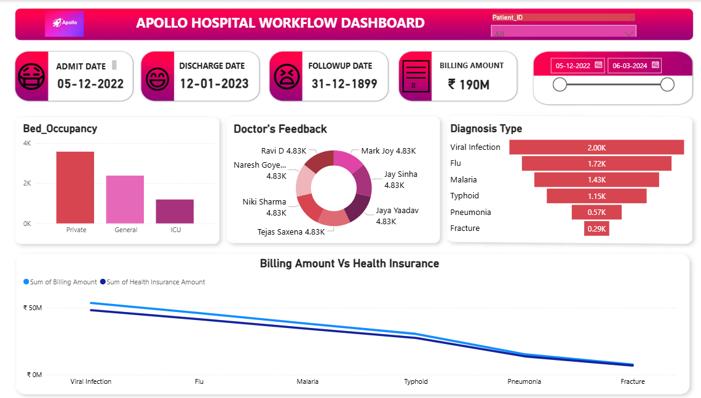

# Apollo Healthcare Analytics Dashboard (Power BI)

## 📌 Project Overview

This project presents an end-to-end **Healthcare Analytics Dashboard** built using **Power BI** on the Apollo Healthcare Dataset. The dashboard provides insights into patient details, billing, bed occupancy, doctor feedback, diagnosis-wise trends, and insurance analysis to support data-driven decision-making for hospital management.

---

## 📑 Table of Contents

1. [Business Problem](#business-problem)
2. [Dataset](#dataset)
3. [Tools--Techniques](#tools--techniques)
4. [Project Structure](#project-structure)
5. [Data Cleaning & Preparation](#data-cleaning--preparation)
6. [Research Questions & Key Findings](#research-questions--key-findings)
7. [Dashboard](#dashboard)
8. [How to Run This Project](#how-to-run-this-project)
9. [Final Recommendations](#final-recommendations)
10. [Author](#author)

---

## Business Problem

<a id="business-problem"></a>
Healthcare organizations generate large volumes of operational and clinical data. However, deriving actionable insights from this data is challenging without proper analytics and visualization. The goal of this project is to build an interactive Power BI dashboard that helps hospital administrators:

* Track patient and billing information efficiently
* Monitor bed occupancy and hospital capacity
* Analyze doctor performance through patient feedback
* Understand diagnosis trends
* Compare insurance coverage vs actual billing

---

## Dataset

<a id="dataset"></a> Dataset
**Dataset Name:** Apollo Healthcare Dataset\n
**Format:** Excel (.xlsx)\n
**Description:** The dataset contains information related to:

* Patient details
* Admission and discharge
* Bed occupancy
* Doctor feedback
* Diagnosis categories
* Billing and insurance amounts

---

## Tools & Techniques

<a id="tools--techniques"></a> Tools & Techniques

* **Power BI** – Data modeling, DAX, interactive dashboard
* **Python (Pandas, NumPy)** – Data preprocessing
* **Jupyter Notebook** – Exploratory checks and transformations
* **SQL (Optional)** – Data querying logic
* **Git & GitHub** – Version control and project hosting

---

## Project Structure

<a id="project-structure"></a>

```
Apollo-Healthcare-Analytics/
│
├── dashboard/
│   └── apollo_healthcare_dashboard.png
│
├── notebooks/
│   └── exploratory_data_analysis.ipynb
│
├── scripts/
│   ├── data_cleaning.py
│   └── ingestion_db.py
│
├── dataset/
│   └── Apollo_Healthcare_Dataset.xlsx
│
├── README.md
└── Apollo_Healthcare_Report.pdf
```

---

## Data Cleaning & Preparation

<a id="data-cleaning--preparation"></a> Data Cleaning & Preparation

* Removed duplicate patient records
* Handled missing values in billing and diagnosis fields
* Standardized date formats
* Created calculated columns for length of stay, total billing, insurance coverage
* Built star schema in Power BI for optimized performance

---

## Research Questions & Key Findings

<a id="research-questions--key-findings"></a> & Key Findings

### Research Questions

* What is the current bed occupancy rate by department?
* Which diagnoses are most common?
* Which doctors receive the highest and lowest feedback scores?
* How much billing amount is covered by insurance?

### Key Findings

* Certain departments consistently show high bed occupancy, indicating capacity pressure
* Cardiology and Orthopedics are among the most frequent diagnosis categories
* A few doctors consistently receive high patient satisfaction scores
* A significant gap exists between total billing and insurance reimbursement in some cases

---

## Dashboard

<a id="dashboard"></a>

### Key Dashboard Views

1. Patient Info by Patient ID
2. Billing Overview
3. Bed Occupancy Breakdown
4. Doctor Feedback Analysis
5. Diagnosis-wise Statistics
6. Billing vs Insurance Comparison

📌 **Dashboard Image:**

https://github.com/Supriya2098/Apollo-Healthcare-Analytics-Dashboard-Power-BI-/blob/main/apollo_dashboard.png

🔗 **Live Power BI Dashboard:**
https://github.com/Supriya2098/Apollo-Healthcare-Analytics-Dashboard-Power-BI-/blob/main/apollo_dashboard.pbix

---

## How to Run This Project

<a id="how-to-run-this-project"></a> This Project

1. Clone the repository:

```bash
git clone https://github.com/yourusername/apollo-healthcare-analytics.git
```

2. Open Power BI Desktop
3. Load the dataset from the `dataset` folder
4. Open the `.pbix` file
5. Refresh data and explore the dashboard

---

## Final Recommendations

<a id="final-recommendations"></a>
Based on the dashboard KPIs and trends, the following **business metrics–driven recommendations** are proposed:

**Operational Efficiency**

* **Bed Occupancy Rate:** Monitor departments with consistently high occupancy (>85%) and plan capacity expansion or patient flow optimization to reduce wait times.
* **Average Length of Stay (ALOS):** Identify diagnoses and departments with higher ALOS to improve care pathways and discharge planning.

**Financial Performance**

* **Total Billing vs. Insurance Coverage:** Track the **Insurance Coverage Ratio (%)** to minimize revenue leakage and improve claim approval cycles.
* **Revenue by Department/Diagnosis:** Prioritize high-revenue, high-demand service lines for resource allocation and staffing.

**Clinical Quality & Experience**

* **Doctor Feedback Score:** Use average feedback and variance to recognize top performers and target training where satisfaction is below benchmarks.
* **Readmission/Repeat Visits (if available):** Monitor to improve treatment effectiveness and patient outcomes.

**Demand & Capacity Planning**

* **Admissions by Diagnosis & Time:** Use monthly/weekly admission trends to forecast demand and align staffing rosters.
* **Bed Turnover Rate:** Optimize turnover to balance quality care with throughput.

**Action Plan (Next 90 Days)**

* Set targets: Occupancy 75–85%, Insurance Coverage Ratio >90%, Avg. Feedback ≥4.5/5.
* Implement monthly KPI review using the Power BI dashboard.
* Launch process improvements for high-ALOS diagnoses and low-coverage insurance cases.

---

## Author

<a id="author"></a>
**Supriya Kusuma**
Aspiring Data Analyst | Power BI | SQL | Python | Healthcare Analytics

---

## 📬 Contact

* GitHub: [https://github.com/Supriya2098](https://github.com/yourusername)
* LinkedIn: [linkedin.com/in/supriya-kusuma09/](https://www.linkedin.com/in/yourprofile)
* Email: [supriyakusuma0905@gmail.com](mailto:yourname@email.com)
